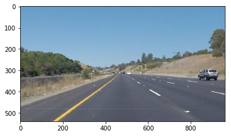
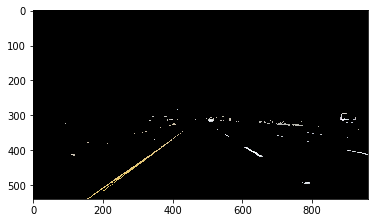
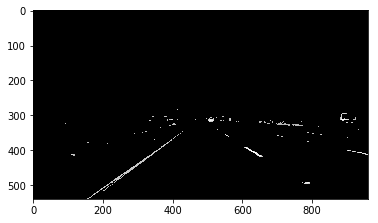
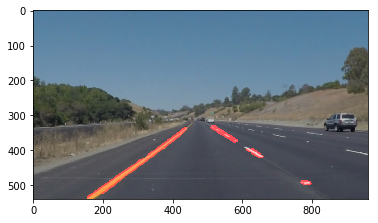
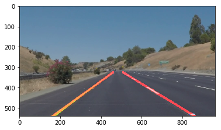

# **Finding Lane Lines on the Road** 

##  2018-02-22

### Markus

---

**Finding Lane Lines on the Road**

The goals / steps of this project are the following:
* Make a pipeline that finds lane lines on the road
* Reflect on your work in a written report

---

### Reflection

### 1. Describe your pipeline. As part of the description, explain how you modified the draw_lines() function.

Original image:

Reducing the image data by

1) applying the color threshold 

2) making it gray scale

3) perspective mask. 

4) using Canny edge detection to find object/line outlines

5) with Hough transformation with radial coordinates identify line segmets

### 2. Identify potential shortcomings with your current pipeline

* Polygon masking is not dynamic. If a camera shifts, side wind, the road curves, there is a vertical changing slope, the masking may fail.
* Contrast betweeen road and markings might not be there in gray scale.
* line markings could be obscured by leaves, objects, etc.

### 3. Suggest possible improvements to your pipeline

A possible improvement would be to dynamically adjust 
- image color line detection, color filters etc.
- multiple runs with different color detection could be done with filters that enhance the markings. (after all there is meaning to the color)
- finally, one should be aware of line thickness, dashed or solid lines, double lines etc. since there is meaning to that.
- redefining region of interest based on last frame line findings
- relative image coordinates to adjust to different size image frames (not an issue in an actual car unless hardware changes)
- likelihood filter to make sense of the lines. One could only allow so and so much of a change from one frame to the other. 
- instead of fitting the data found in the pipeline to a line, one could model what a line should look like including curves etc. and fit the data to that.

Finally, the video pipeline was developed a bit further to include the solid line fits:

